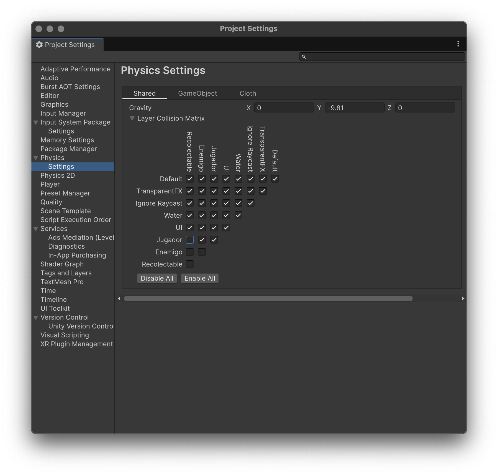

# Práctica 3: Físicas

<embed src="Experimentando con las fisicas.pdf" type="application/pdf" width="600" height="400" />

## Ejercicio 1 — Control de personaje con Rigidbody
- Se creó un personaje que se puede mover usando las teclas **WASD** o las flechas.
- El movimiento está controlado mediante un **Rigidbody**, permitiendo que la física afecte al personaje (gravedad, colisiones) mientras se mantiene control total sobre su desplazamiento.
- Se utilizó `rb.MovePosition()` en `FixedUpdate` para que se ejecute en intervalos fijos de tiempo y no dependa de los FPS.

## Ejercicio 2 — Colisiones y cambio de color
- Se crearon varios objetos (cubos y esferas) con **Rigidbody dinámico** y **Collider**.
- Al colisionar con otro objeto, se muestra por consola el nombre del objeto colisionado y se cambia el color del objeto mediante el **Renderer**.
- Se utilizó el método `OnCollisionEnter()` para detectar colisiones y aplicar los cambios visuales.

## Ejercicio 3 — Zonas con Trigger
- Se definieron zonas mediante cubos grandes con **Is Trigger = true** e **Is Kinematic = false**.
- Al entrar en la zona de color, el personaje cambia de color y al salir vuelve al color original.
- Se creó otra zona de daño que aumenta una variable `damage` del personaje al entrar en ella.
- Se utilizaron los métodos `OnTriggerEnter()` y `OnTriggerExit()` para detectar entradas y salidas.

## Ejercicio 4 — Capas y Layer Collision Matrix
- Se crearon tres capas: **Jugador**, **Enemigo**, y **Recolectable**.
- Se configuró la **Layer Collision Matrix** para que:
  - Los enemigos solo colisionen con el jugador.
  - Los recolectables no colisionen con ningún objeto y solo se detecten mediante triggers.
- Esto permite controlar qué objetos interactúan físicamente y optimizar el rendimiento de la física en la escena.

## Ejercicio 5 — Physic Materials y fuerzas
- Se crearon varios objetos con distintos **Physic Materials**:
  - Resbaladizo
    - Dynamic Friction: 0
    - Static Friction: 0
    - Bounciness: 0
    - Friction Combine: Minimum
  - Rugoso
    - Dynamic Friction: 1
    - Static Friction: 1
    - Bounciness: 0
    - Friction Combine: Maximum
  - Rebote alto
    - Dynamic Friction: 0.6
    - Static Friction: 0.6
    - Bounciness: 1
    - Bounce Combine: Maximum
- Se aplicó `AddForce()` al presionar la tecla **X** para lanzar los objetos.
- Se observó cómo la fricción y el rebote afectan la reacción de cada objeto al ser lanzado, destacando las diferencias físicas entre materiales.

